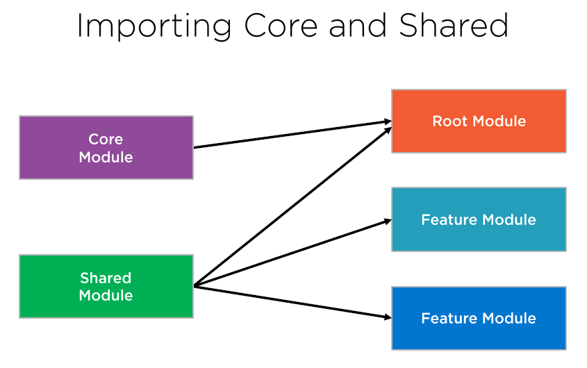

# Moduly

<figure><figcaption>
Dopručené vazby mezi moduly
</figcaption></figure>

## Root Module (AppModule)

Hlavní modul aplikace a každá aplikace ho musí mít. Je to /app/app.module.ts.&#x20;

## Core Module

**Zde jsou singletonové služby sdílené v aplikaci**. Věci specifické pro Feature Moduly mají být v nich.

Modul importuj jenom do Root modulu, jinam ne.

Platí to i pro moduly s proxy http služeb? Řekl bych že ano. Stejně jako služby logování a ošetření chyb jsou sdílené.&#x20;

## Shared Feature Module (SharedModule)

Vygeneruj do /app/shared modul shared.module.ts. V něm deklaruj komponenty, direktivy a pipe, které použiješ ve více feature modulech. Exportuj je ven, aby je ostatní mohli používat. \
Tenhle modul je opravdu sdílený v aplikaci, hlavně ve Feature modulech, ale použije ho i root AppModule. **Nedávej ho do CoreModule**, viz obrázek.

**Nedeklaruj v něm services**, protože jsou (většinou) singletony a poskytují se buď na úrovní celé aplikace nebo v jednom feature modulu. Když se aktivuje lazy modul, který importuje Shared modul, tak by si vytvořil vlastní kopii služby. Potom ta služba není singleton a můžeš se divit co se tam děje. \
\
Vyjímkou jsou služby bez vnitřního stavu (dat), protože uživatelé služby nesdílí data v té službě. _nevím jistě jestli tomu rozumím_

**Do SharedModule importuj sdílené moduly třetích stran**, jako je CommonModule, FormsModule. Je to proto, že ve SharedModule budou komponenty, direktivy a pipes, které potřebují ngFor, FormControl apod.

## Feature Moduly

Tyhle moduly obsahují komponenty a služby specifické pro nějakou funkcionalitu aplikace.

Rozdělují se na moduly načítané při startu aplikace a na načítané odloženě (lazy loaded). Je důležité nikdy neimportovat lazy loaded moduly přímo -> pak se inicializují hned.

Lazy loaded moduly je doporučené mít ve zvláštním adresáři, aby se dobře poznaly. Lazy moduly nejsou nikde referencované, protože se vytvářejí dynamicky, v routovacím modulu ve funkci loadChildren.

### Jak přidat do aplikace?

ng generate module \<jméno (bez koncovky Module)>

Do /src/app/ přidá adresář \<jméno> a do něj soubor \<jméno>.module.ts. Je v něm prázná exportovaná třída \<jméno>Module a s importem CommonModule.

